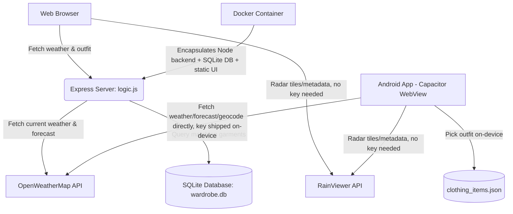

# SkyWardrobe

SkyWardrobe is a real-time weather-integrated wardrobe assistant. It translates local weather metrics (temperature, humidity, precipitation, wind speed) into context-aware, stylist-oriented clothing recommendations.

This repository is split into three standalone versions, all featuring current weather, wardrobe recommendations, and the full Rain & Radar feature set (interactive precipitation radar, rain forecast graph, next-rain summary, hourly timeline, insights, and rain-aware wardrobe advice):
1. **[SkyWardrobe-Web](./SkyWardrobe-Web)**: The Express/Node.js web application containing the dynamic, SQLite-backed wardrobe recommendation engine, styling logic, and interactive dashboard UI. Holds the OpenWeatherMap API key server-side.
2. **[SkyWardrobe-Docker](./SkyWardrobe-Docker)**: Production-ready Docker containerization of the web application for seamless deployment on Linux (Ubuntu), macOS, and Windows.
3. **[SkyWardrobe-Android](./SkyWardrobe-Android)**: A fully standalone Capacitor-wrapped mobile build with an on-device (JSON-based) wardrobe engine and no backend of its own — it calls OpenWeatherMap and RainViewer directly from the device. Because a shipped app bundle can't hide a secret, its API key is expected to be extractable; see its own README for that tradeoff and the mitigation (a key dedicated to the app).

## Project Architecture

## Folder Structure
* `SkyWardrobe-Web/`: The web application. Includes the Express backend server, SQLite wardrobe database, seeder scripts, and frontend static assets.
* `SkyWardrobe-Docker/`: The Dockerized web application with Dockerfile, docker-compose.yml, and automated container startup orchestration.
* `SkyWardrobe-Android/`: The Capacitor mobile wrapper. Fully standalone — talks directly to OpenWeatherMap and RainViewer, no server required.
