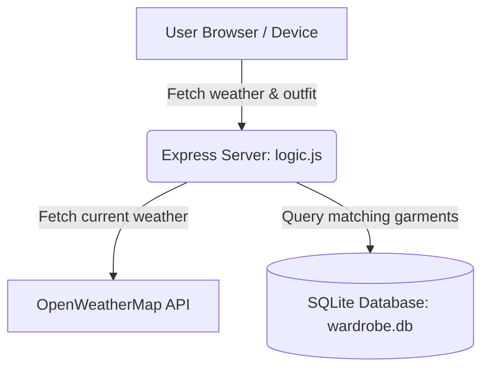

# SkyWardrobe

SkyWardrobe is a real-time weather-integrated wardrobe assistant. It translates local weather metrics (temperature, humidity, precipitation, wind speed) into context-aware, stylist-oriented clothing recommendations.

This repository is split into two standalone versions:
1. **[SkyWardrobe-Web](./SkyWardrobe-Web)**: The Express/Node.js web application containing the dynamic, SQLite-backed wardrobe recommendation engine, styling logic, and interactive dashboard UI.
2. **[SkyWardrobe-Android](./SkyWardrobe-Android)**: The mobile-specific equivalent folder (currently a clean slate for future native Android/Capacitor implementation).

## Project Architecture

## Folder Structure
* `SkyWardrobe-Web/`: The web application. Includes the Express backend server, SQLite wardrobe database, seeder scripts, and frontend static assets.
* `SkyWardrobe-Android/`: Dedicated space for the Android mobile wrapper.
